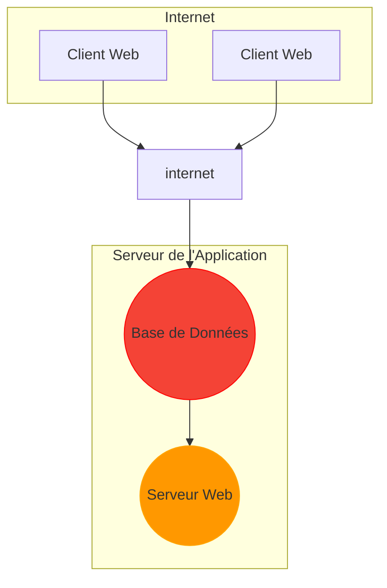

# Plan de Table DELTIC - README
Ce README fournit des informations sur le projet "Plan de Table DELTIC", qui comprend une application web et un serveur. L'application permet de gérer le plan de table d'une entreprise en attribuant des employés à des bureaux de manière aléatoire. Les employés peuvent être ajoutés, supprimés et réorganisés sur les bureaux. Le serveur gère la persistance des données des employés et des bureaux.

## Fonctionnalités principales
### Application Web
1. Affichage du Plan de Table: L'application affiche un plan de table avec plusieurs bureaux contenant des employés ou des emplacements vides.

2. Ajout d'Employés: Les utilisateurs peuvent ajouter de nouveaux employés en spécifiant leur prénom et en téléchargeant une image.

4. Suppression d'Employés: Les employés existants peuvent être supprimés de la liste.

5. Réorganisation Aléatoire des Employés: Les employés peuvent être mélangés de manière aléatoire et réorganisés sur les bureaux.

### Serveur
1. Ajout d'Employés: Le serveur gère l'ajout d'employés en enregistrant leur prénom et le nom de l'image associée dans un fichier JSON.

2. Chargement des Employés: Le serveur fournit une API pour charger la liste des employés existants.

3. Chargement des Bureaux: Le serveur fournit une API pour charger la configuration des bureaux.

4. Suppression d'Employés: Le serveur permet de supprimer un employé spécifique en utilisant un identifiant.

## Configuration requise
* Node.js et NPM installés sur le serveur.
* Les dépendances NPM du projet installées (express, cors, body-parser, multer).

## Comment exécuter le projet
1. Clonez le référentiel depuis GitHub : git clone <repository_url>.
2. Allez dans le répertoire du projet : cd plan-de-table-deltic.
3. Installez les dépendances du serveur : npm install.
4. Démarrez le serveur : node server.js.
5. Ouvrez l'application web en accédant à http://54.38.32.241/planDeTable/ dans votre navigateur.


## schéma reseau (mermaid)




## schéma UML (mermaid)

### cas d'utilisation

```mermaid
sequenceDiagram

actor utilisateur
subgraph
    serveur
    utilisateur ->> serveur : demande de la liste des employés
    serveur ->> utilisateur : liste des employés
    end
end
